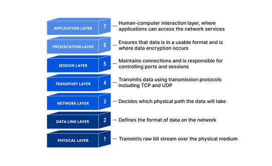
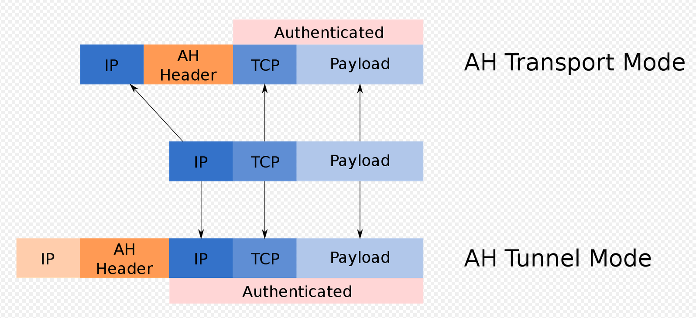
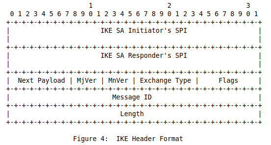
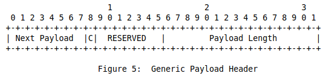
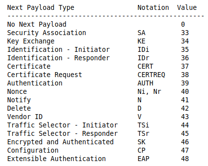
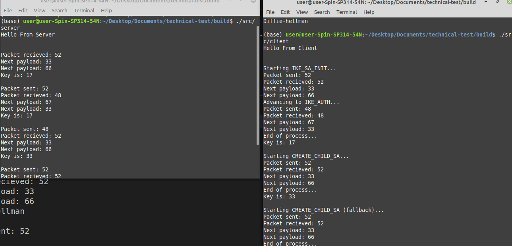

# Tasks

Design an [IKE protocol](https://datatracker.ietf.org/doc/html/draft-nagayama-ipsecme-ipsec-with-qkd-01) for IPSec consuming QKD keys.
1. the secure local connection between QKD device and IPSec Gateway
2. the Initialization, Re-keying and Fallback protocols between IPSec Gateways

## History of IPsec for IKE

Year 1995: RFC 1825 to RFC 1829 (Original)

Year 1998: RFC 2401 to RFC 2412 (Revision; ISAKMP, IKE introduced)

Year 2005: RFC 4301 to RFC 4309 (IKEv2)

Year 2010: RFC 5996 (Updates IKEv2)

Year 2014: [Experimental draft](https://datatracker.ietf.org/doc/html/draft-nagayama-ipsecme-ipsec-with-qkd-01) (QKD)

Year 2014: RFC 7296 (Updates IKEv2)

## What is IPsec?

In computing, Internet Protocol Security (IPsec) is a secure network
protocol suite that authenticates and encrypts packets of data to provide
secure encrypted communication between two computers over an Internet
Protocol network.

Hence, in the OSI model, it operates over the Network Layer.



In terms of implementation, it is done over the datagram of Internet Protocol Network



## What is IKE?

IKE is a component of IPsec used for performing mutual authentication and
establishing and maintaining Security Associations (SAs).

All IKE communications consist of pairs of messages: a request and a
response. The pair is called an "exchange", and is sometimes called
a "request/response pair". The first exchange of messages
establishing an `IKE SA` are called the `IKE_SA_INIT` and `IKE_AUTH`
exchanges; subsequent IKE exchanges are called the `CREATE_CHILD_SA` or
`INFORMATIONAL` exchanges.

---
**NOTE**

It is possible that the protected endpoint will be behind a NAT.
In that case, the IP address as seen by the security
gateway will not be the same as the IP address sent by the protected
endpoint, and packets will have to be UDP encapsulated in order to be
routed properly.

[IKE header rules](https://www.rfc-editor.org/rfc/rfc5996#section-3.1)

---

## IKE message format (RFC5996)

Each IKE message is of the following format:

**1 header**



Followed by **arbitrary amount of payloads**, with each payload having a payload header



### Types of payload



# Task Breakdown

1. [Initialization Protocol](./docs/initialization.md)
2. [Re-keying Protocol](./docs/re-keying.md)
3. [Fallback Protocol](./docs/fallback.md)
4. [Secure Local Connection Protocol]()

# Quickstart

1. Install `conan`
```
pip install conan
```

2. Update `conan` to use new ABI
```
conan profile detect
```

3. Make build directory
```
mkdir build && cd build
```

4. Install dependencies (in `build` directory)
```
conan install .. --output-folder=./ --build=missing 
```

5. Build `src`
```
cmake .. -DCMAKE_TOOLCHAIN_FILE=conan_toolchain.cmake -DCMAKE_BUILD_TYPE=Release
cmake --build .
```

6. Upon compiling, executables can be found in the `./build` directory, specifically `./build/src`.

# Running the example

`client.cpp` and `server.cpp` are 2 files to show case the Initialization, Re-keying and Fallback protocols.

You should first execute the `server` executable then the `client`.
The `client` will take on the role of the **initiator** and `server` will be the **responder**.

