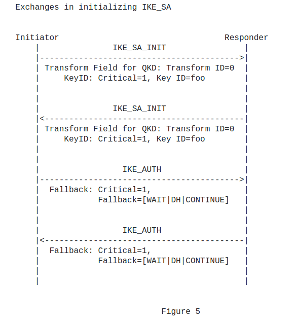
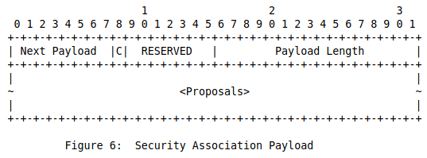
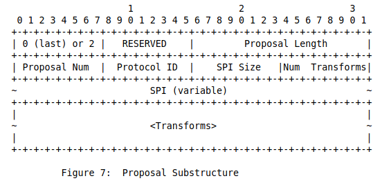
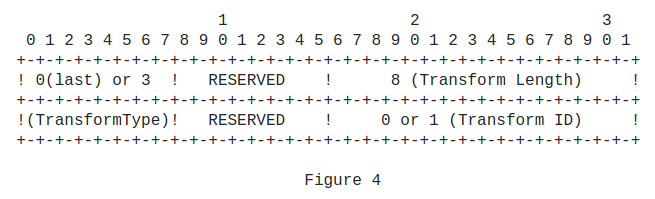
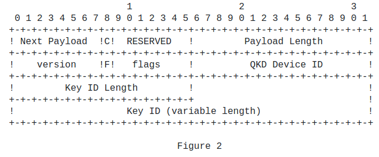
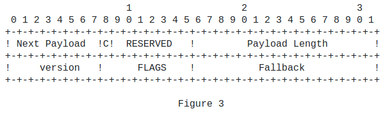

# Initialization

Communication using IKE always begins with `IKE_SA_INIT` and `IKE_AUTH`
exchanges (known in `IKEv1` as Phase 1). These initial exchanges
normally consist of four messages, though in some scenarios that
number can grow. All communications using IKE consist of request/
response pairs.



## IKE_SA_INIT

**Initiator**

HDR, SAi1, KEi, Ni KeyID   -->

**Responder**

<--   HDR, SAr1, KEr, Nr, KeyID

## IKE_AUTH

**Initiator**

HDR, SK{IDi, [CERT,] [CERTREQ,] [IDr,]
QKDfallback, AUTH, SAi2, TSi, TSr}  -->

**Responder**

<--  HDR, SK{IDr, [CERT,] QKDfallback, 
AUTH, SAr2, TSi, TSr}

## Security Association Payload

The Security Association payload, denoted SA in this document, is used to negotiate attributes of a Security Association. Assembly of
Security Association payloads requires great peace of mind. An SA
payload MAY contain multiple proposals.

Structure is as of follows:

```code
   SA Payload
      |
      +--- Proposal #1 ( Proto ID = ESP(3), SPI size = 4,
      |     |            7 transforms,      SPI = 0x052357bb )
      |     |
      |     +-- Transform ENCR ( Name = ENCR_AES_CBC )
      |     |     +-- Attribute ( Key Length = 128 )
      |     |
      |     +-- Transform ENCR ( Name = ENCR_AES_CBC )
      |     |     +-- Attribute ( Key Length = 192 )
      |     |
      |     +-- Transform ENCR ( Name = ENCR_AES_CBC )
      |     |     +-- Attribute ( Key Length = 256 )
      |     |
      |     +-- Transform INTEG ( Name = AUTH_HMAC_SHA1_96 )
      |     +-- Transform INTEG ( Name = AUTH_AES_XCBC_96 )
      |     +-- Transform ESN ( Name = ESNs )
      |     +-- Transform ESN ( Name = No ESNs )
      |
      +--- Proposal #2 ( Proto ID = ESP(3), SPI size = 4,
            |            4 transforms,      SPI = 0x35a1d6f2 )
            |
            +-- Transform ENCR ( Name = AES-GCM with a 8 octet ICV )
            |     +-- Attribute ( Key Length = 128 )
            |
            +-- Transform ENCR ( Name = AES-GCM with a 8 octet ICV )
            |     +-- Attribute ( Key Length = 256 )
            |
            +-- Transform ESN ( Name = ESNs )
            +-- Transform ESN ( Name = No ESNs )
```

Headers:







---
**NOTE**

Transform Length must be fixed at 8 since QKD does not need the
Transform Attributes field.

Draft [here](https://datatracker.ietf.org/doc/html/draft-nagayama-ipsecme-ipsec-with-qkd-01).

---

## QKD KeyID Payload

This payload contains information pertaining the QKD device.



## Fallback Payload

This payload contains information pertaining to fallback 
(when QKD cannot be used).


