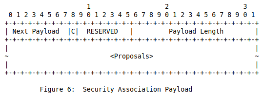
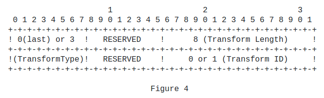

# Re-keying

The `CREATE_CHILD_SA` exchange is used to create new Child SAs and to
rekey both IKE SAs and Child SAs.  This exchange consists of a single
request/response pair, and some of its function was referred to as a
Phase 2 exchange in IKEv1.  It MAY be initiated by either end of the
IKE SA after the initial exchanges are completed.
An SA is rekeyed by creating a new SA and then deleting the old one.


## CREATE_CHILD_SA

**Initiator**

HDR, SK{[N], SA, Ni, KeyID,
        [KEi,] [TSi, TSr]}   -->

**Responder**

<--   HDR, SK{SA, Nr, KeyID,
        [KEr,] [TSi, TSr]}

## Security Association Payload

The Security Association payload, denoted SA in this document, is used to negotiate attributes of a Security Association. Assembly of
Security Association payloads requires great peace of mind. An SA
payload MAY contain multiple proposals.

Structure is as of follows:

```code
   SA Payload
      |
      +--- Proposal #1 ( Proto ID = ESP(3), SPI size = 4,
      |     |            7 transforms,      SPI = 0x052357bb )
      |     |
      |     +-- Transform ENCR ( Name = ENCR_AES_CBC )
      |     |     +-- Attribute ( Key Length = 128 )
      |     |
      |     +-- Transform ENCR ( Name = ENCR_AES_CBC )
      |     |     +-- Attribute ( Key Length = 192 )
      |     |
      |     +-- Transform ENCR ( Name = ENCR_AES_CBC )
      |     |     +-- Attribute ( Key Length = 256 )
      |     |
      |     +-- Transform INTEG ( Name = AUTH_HMAC_SHA1_96 )
      |     +-- Transform INTEG ( Name = AUTH_AES_XCBC_96 )
      |     +-- Transform ESN ( Name = ESNs )
      |     +-- Transform ESN ( Name = No ESNs )
      |
      +--- Proposal #2 ( Proto ID = ESP(3), SPI size = 4,
            |            4 transforms,      SPI = 0x35a1d6f2 )
            |
            +-- Transform ENCR ( Name = AES-GCM with a 8 octet ICV )
            |     +-- Attribute ( Key Length = 128 )
            |
            +-- Transform ENCR ( Name = AES-GCM with a 8 octet ICV )
            |     +-- Attribute ( Key Length = 256 )
            |
            +-- Transform ESN ( Name = ESNs )
            +-- Transform ESN ( Name = No ESNs )
```

Headers:






---
**NOTE**

Transform Length must be fixed at 8 since QKD does not need the
Transform Attributes field.

Draft [here](https://datatracker.ietf.org/doc/html/draft-nagayama-ipsecme-ipsec-with-qkd-01).

---

## QKD KeyID Payload

This payload contains information pertaining the QKD device.


